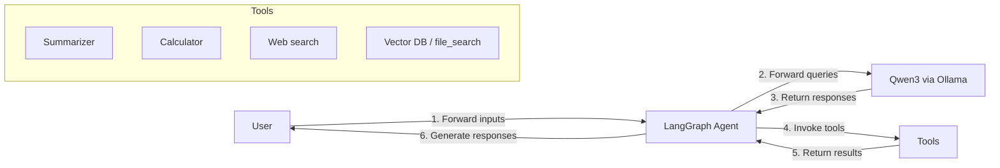
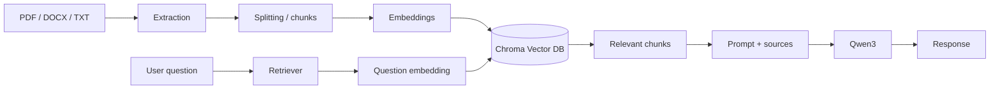
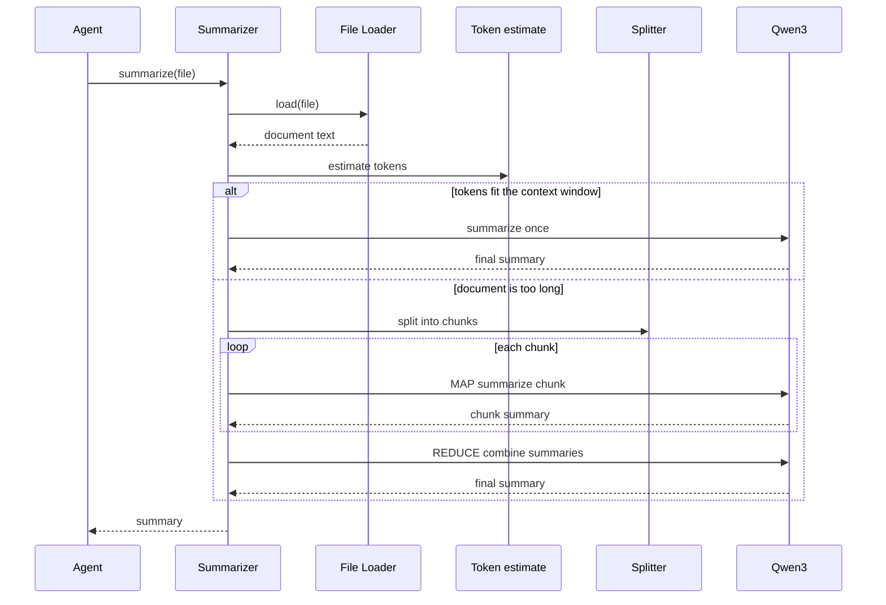

# Local AI Research Assistant (V1)

A lightweight research assistant that runs **Qwen3 locally through Ollama**. LangGraph orchestrates the agent. RAG is a retrieval capability the agent can invoke — it is not the same thing as LangGraph.

Users can ask questions about uploaded documents, search the web, calculate, summarize long papers with Map-Reduce, and combine those skills in one request.

This is Version 1: small, local, and easy to explain in an internship interview.

## Features

- Local LLM inference with **Ollama + Qwen3** (no cloud LLM APIs)
- Streamlit chat UI with file upload
- RAG over PDF, DOCX, TXT, and HTML
- Persistent **Chroma** vector store
- Dynamic tool calling (no hard-coded intent `if/elif` router)
- Tools: `file_search`, `web_search`, `calculator`, `summarize`
- Map-Reduce summarization with a context-window check
- Source citations (filename/page for RAG; title/URL for web search)

## Architecture

LangGraph is the orchestrator. RAG, web search, the calculator, and Map-Reduce summarization are tools or internal pipelines the agent can use.

```text
User
  → Streamlit (text / files)
  → LangGraph Agent
  → Qwen3 (Ollama)
  → tool calls if needed
       ├── file_search  → embeddings → Chroma → relevant chunks
       ├── web_search   → DuckDuckGo or Tavily
       ├── calculator   → safe expression parser
       └── summarize    → File Loader → Tokenizer estimate → Split → Map → Reduce
  → tool results
  → Agent / Qwen3
  → response
```

### Overall Agent Workflow



The agent may loop between Qwen3 and tools several times before answering.

### RAG Workflow

Parser, chunking, embedding, and Chroma are **internal** to the RAG pipeline. The user-facing tool is `file_search`.



### Summarization (Map-Reduce)



## Tech stack

| Area | Choice |
| --- | --- |
| Agent orchestration | LangGraph |
| LLM | Qwen3 via Ollama |
| RAG store | ChromaDB |
| Embeddings | `sentence-transformers/all-MiniLM-L6-v2` (local) |
| UI | Streamlit |
| Search | DuckDuckGo (`ddgs`) or Tavily |
| Files | pypdf, python-docx, BeautifulSoup |

## Installation

Python 3.11+ is required. Create a virtual environment named **`.venv`** in the project root (not `venv` or `env`).

**Windows (PowerShell):**

```powershell
cd C:\Users\LENOVO\ResearchAiAgent
python -m venv .venv
.\.venv\Scripts\python.exe -m pip install -r requirements.txt
copy .env.example .env
```

If `.\.venv\Scripts\Activate.ps1` is blocked by the execution policy, you do not need it. Call the venv Python directly as shown above.

Optional activation (only if the script is allowed):

```powershell
cd C:\Users\LENOVO\ResearchAiAgent
.\.venv\Scripts\Activate.ps1
python -m pip install -r requirements.txt
copy .env.example .env
```

**macOS / Linux:**

```bash
cd /path/to/ResearchAiAgent
python3 -m venv .venv
.venv/bin/python -m pip install -r requirements.txt
cp .env.example .env
```

The first document ingest downloads the MiniLM embedding model.

## Ollama + Qwen3 setup

1. Install Ollama from [https://ollama.com](https://ollama.com) and start it.

2. Pull Qwen3 (default lightweight local model):

```bash
ollama pull qwen3:8b
```

If `qwen3:8b` is too large for your GPU/RAM, pick a smaller Qwen3 tag that your machine can run, then set `OLLAMA_MODEL` in `.env`. Stay on the Qwen3 family.

3. Verify the model:

```bash
ollama list
ollama run qwen3:8b "Reply with: Ollama Qwen3 is working."
```

4. Confirm the API:

```bash
curl http://127.0.0.1:11434/api/tags
```

The app uses this model for chat, tool decisions, RAG answers, and Map-Reduce summarization.

## Environment variables

Copy `.env.example` to `.env` and adjust as needed.

| Variable | Default | Purpose |
| --- | --- | --- |
| `OLLAMA_BASE_URL` | `http://127.0.0.1:11434` | Ollama server |
| `OLLAMA_MODEL` | `qwen3:8b` | Qwen3 model name |
| `EMBEDDING_MODEL` | `sentence-transformers/all-MiniLM-L6-v2` | Local embeddings |
| `CHUNK_SIZE` / `CHUNK_OVERLAP` | `800` / `120` | Text splitting |
| `RETRIEVAL_K` | `4` | Top-k chunks |
| `MAX_CONTEXT_TOKENS` | `2500` | Retrieved-context budget |
| `CONTEXT_WINDOW_TOKENS` | `8192` | Map-Reduce split threshold |
| `SEARCH_PROVIDER` | `duckduckgo` | `duckduckgo` or `tavily` |
| `TAVILY_API_KEY` | empty | Required only for Tavily |

## How to run

1. Start Ollama and make sure the model in `.env` (`OLLAMA_MODEL`) is installed (`ollama list`).
2. From the project root, run Streamlit **with the `.venv` interpreter**:

**Windows (PowerShell):**

```powershell
cd C:\Users\LENOVO\ResearchAiAgent
.\.venv\Scripts\python.exe -m streamlit run app.py
```

**macOS / Linux:**

```bash
cd /path/to/ResearchAiAgent
.venv/bin/python -m streamlit run app.py
```

Open the URL Streamlit prints (usually `http://localhost:8501`).

Stop the previous Streamlit process (Ctrl+C) and start it again after pulling these files so `.streamlit/config.toml` is applied. That config turns off Streamlit's file watcher, which otherwise prints long `torchvision` / `transformers` traces that are not application crashes.

Do not run a system-wide `streamlit` unless that same `.venv` is active. The working directory must be the project root so `app.py` and `.env` resolve correctly.

## Example use cases

| Mode | Example query |
| --- | --- |
| General Q&A | `What is retrieval-augmented generation in one paragraph?` |
| RAG | Upload a paper, then `What is the main contribution of this paper?` |
| Web search | `What are recent approaches for LoRA? Include sources.` |
| Calculation | `What is 1234 * 0.15?` |
| Short summary | Upload a short TXT, then `Summarize the uploaded document.` |
| Long Map-Reduce | Upload a long PDF, then `Summarize this paper, focusing on methods.` |
| Multi-tool | `Search the web for recent LoRA papers and compare them with the paper I uploaded.` |

## RAG workflow

1. Upload a file in the sidebar.
2. The loader extracts text (PDF pages, DOCX paragraphs, TXT, or HTML).
3. Recursive splitting produces overlapping chunks with `filename`, `page`, and `chunk_index`.
4. MiniLM embeddings are stored in Chroma under `data/chroma/`.
5. Identical file content is not ingested twice.
6. At question time, `file_search` embeds the query, retrieves top-k chunks under a token budget, and returns cited passages to the agent.
7. Qwen3 writes the answer with sources such as `paper.pdf, page 4`.

## Agent workflow

1. The user message is appended to chat history.
2. LangGraph starts at the `agent` node and calls Qwen3 with tools bound.
3. If Qwen3 requests tools, `ToolNode` runs them and returns results.
4. Control goes back to `agent` until Qwen3 produces a final message with no tool calls.
5. Streamlit shows which tools ran (RAG, web search, calculator, summarization).

There is no keyword router. Qwen3 chooses tools from the request and the tool descriptions.

## Map-Reduce explanation

The summarizer is a separate module (`summarization/map_reduce.py`). The agent only sees the `summarize` tool.

- Estimate tokens with a simple `len(text) // 4` heuristic.
- If the document fits `CONTEXT_WINDOW_TOKENS` minus a reserved reply budget, summarize in one Qwen3 call.
- If it does not fit, split into chunks, **map** (summarize each chunk), then **reduce** (merge summaries). If the merge is still large, reduce recursively.

## Context-window management

- Retrieved chunks are trimmed to `MAX_CONTEXT_TOKENS`.
- Retrieval stops adding chunks when the budget is full.
- Summarization never sends an entire long document in one prompt.
- The calculator never needs the document context.

This is intentionally simple: prevent oversized prompts, not a full token optimizer.

## Project structure

```text
project/
├── app.py
├── llm.py
├── requirements.txt
├── README.md
├── .env.example
├── .gitignore
├── config/
│   └── settings.py
├── agent/
│   ├── graph.py
│   ├── state.py
│   └── prompts.py
├── tools/
│   ├── file_search.py
│   ├── web_search.py
│   ├── calculator.py
│   └── summarize.py
├── rag/
│   ├── ingestion.py
│   ├── embeddings.py
│   ├── retriever.py
│   └── vector_store.py
├── summarization/
│   └── map_reduce.py
├── loaders/
│   └── document_loader.py
├── utils/
│   ├── tokens.py
│   ├── ollama.py
│   └── errors.py
└── data/
    ├── chroma/
    └── uploads/
```

## Limitations

- Qwen3 tool calling quality depends on the Ollama model tag and VRAM.
- Token counts are estimates, not the official Qwen tokenizer.
- DuckDuckGo can rate-limit; Tavily needs an API key.
- No login, no multi-user isolation, no production crawler.
- HTML support is file upload only, not a general web scraper.
- Very large PDFs will be slow because Map-Reduce calls Qwen3 once per chunk.

## Future improvements

- Official Qwen tokenizer for tighter budgets
- Streaming tokens in the UI
- Optional URL fetch for HTML pages
- Better PDF table/layout extraction
- Evaluation set for RAG faithfulness
- Conversation memory beyond the current Streamlit session list
